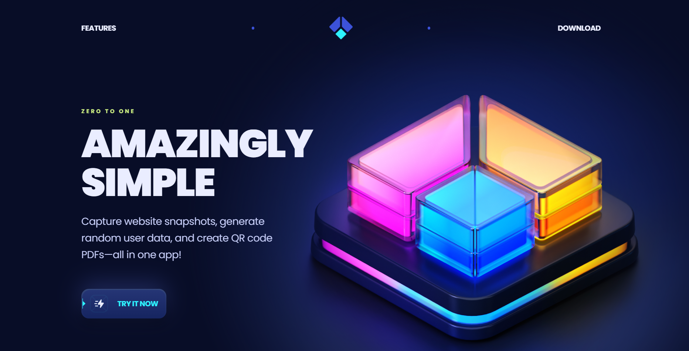
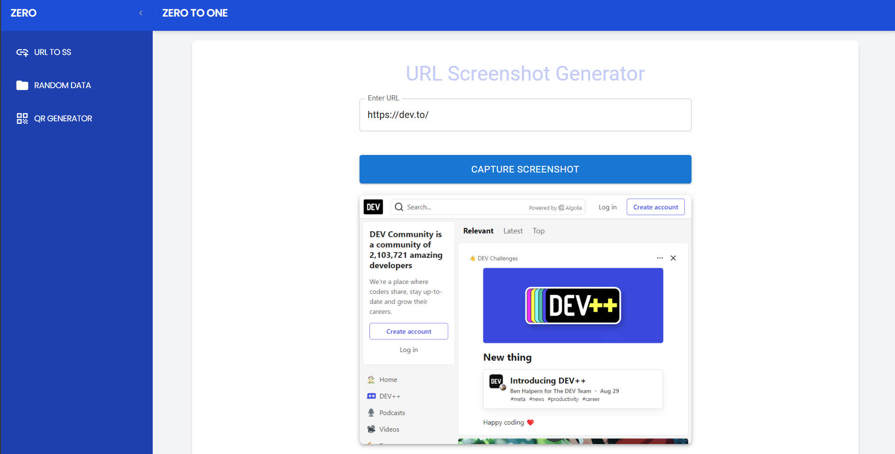
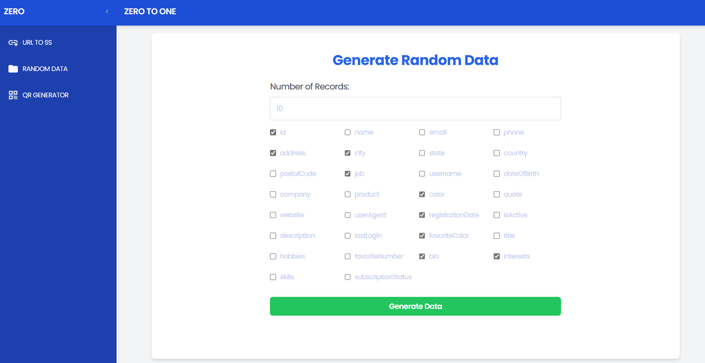
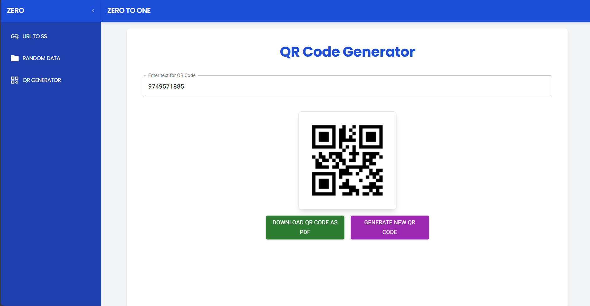

# Multi-Function Web App
## Screenshots


This web application, built with React and Express, offers three main functionalities:

1. **Website Screenshot Generator**: Capture a screenshot of any website by entering its URL.


2. **Random User Data Generator**: Generate random user data and download it as a CSV file.


3. **PDF with QR Code Generator**: Convert input information into a PDF containing a QR code.



## Usage
1. Website Screenshot Generator: Enter the URL of the website you want to capture and click on "Capture Screenshot." You can download the screenshot after it is generated.

2. Random User Data Generator: Select the fields you want to include, specify the number of records (up to 100,000), and click "Generate Data" to download the CSV file.

3. PDF with QR Code Generator: Enter the text for the QR code and click "Generate QR Code." You can then download the QR code in a PDF format.


## Table of Contents

- [Features](#features)
- [Technologies Used](#technologies-used)
- [Installation](#installation)
- [Usage](#usage)
- [API Endpoints](#api-endpoints)

## Features

- Capture and download website screenshots.
- Generate random user data with customizable fields.
- Create a QR code and download it in a PDF format.

## Technologies Used

- **Frontend**: React, Material-UI, Tailwind CSS
- **Backend**: Express.js
- **Utilities**: Axios, json2csv, faker, Chance, qrcode, jsPDF

## Installation

To run this project locally, follow these steps:

1. **Clone the repository**:

```bash
   git clone https://github.com/sidhyaashu/ZERO.git
```
2. **Install dependencies Fontend**:

```bash
cd client
npm install
```
3. **Install dependencies backend**:

```bash
cd server
npm install
```
4. **Run the application fontend**:

```bash
cd server
npm run dev
```
5. **Run the application backend**:

```bash
cd client
npm run dev
```

The application should now be running at http://localhost:3000.

## API Endpoints
1. POST /api/take-ss/take-screenshot: Captures a screenshot of the provided URL.
2. POST /api/gen-data/generate-data: Generates random user data based on the selected fields and number of records.


### Customization
- Replace `https://github.com/sidhyaashu/ZERO` with your actual GitHub repository link.


## Frontend Packages
 - React: [react](https://vitejs.dev/guide/)
 - Material-UI: [@mui/material](https://mui.com/material-ui/)
 - Tailwind CSS: [tailwindcss](https://tailwindcss.com/)
 - Axios: [axios](https://axios-http.com/docs/intro)
 - jsPDF: [jspdf](https://parallax.github.io/jsPDF/docs/jsPDF.html)
 - Framer Motion: [framer-motion](https://www.framer.com/motion/)
 - QRCode: https://www.npmjs.com/package/qrcode

## Backend Packages
 - Express: [express](https://expressjs.com/)
 - json2csv: https://www.npmjs.com/package/json2csv
 - Faker: https://www.npmjs.com/package/@faker-js/faker
 - Chance: https://www.npmjs.com/package/chance